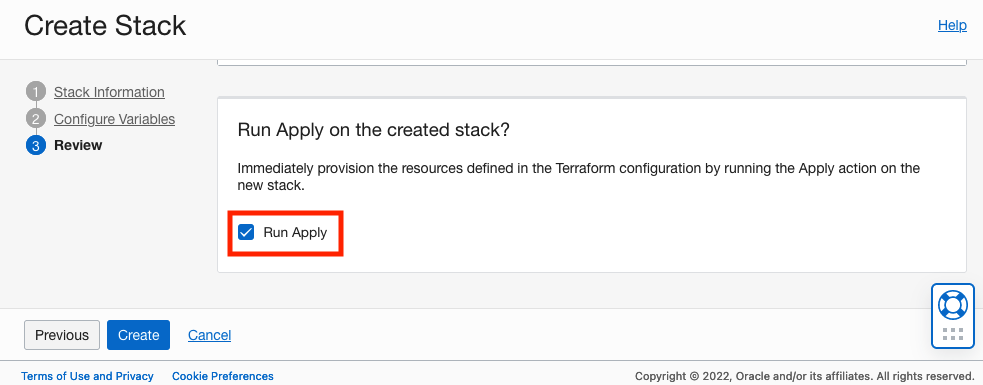

# Example environment for cloud camera processing.

[](https://img.shields.io/badge/license-UPL-green) [](https://sonarcloud.io/dashboard?id=oracle-devrel_terraform-oci-cloud-camera)

## Introduction
This is a really basic topology for having an OCI Compute instance setup with a GUI and VLC.  From there, the possibilities are pretty endless... receive a stream, forward it on, save the stream, etc.  This is the basic environment for other potential future projects that work with camera feeds from embedded systems (such as Raspberry Pis, ESP32s, etc.).

Here's an overview of some of the big points for the OCI Compute instance in this example:
* GUI installed
* VNC installed
* VLC installed
* Firewalld disabled
* SELinux disabled
* Password for OPC configured (so that if the GUI locks, it can be unlocked)

As far as specific Network Security Group policies, here's a highlight (see `nsg.tf` for more info):
* Outbound HTTPS is permitted
* Inbound UDP on the service port is permitted for the CIDRs in `var.permitted_access_cidrs`
* All inbound ICMP is permitted for the CIDRs in `var.permitted_access_cidrs`
* All inbound UDP is permitted for the CIDRs in `var.permitted_access_cidrs`

It's pretty basic, but provides a solid foundation for future iteration and work in handling video feeds.

## Getting Started
You must have an OCI account.  [Click here](https://www.oracle.com/cloud/free/?source=:ex:tb:::::WWMK211208P00078&SC=:ex:tb:::::WWMK211208P00078&pcode=WWMK211208P00078) to create a new cloud account.

There are a couple of options for deploying this project:
* Oracle Cloud Resource Manager
* Terraform CLI
* Oracle Cloud Shell

It might seem odd and counter-productive to set a password for the `opc` user account. Since you'll be accessing the instance via a GUI, this password is largely available for if/when the screen might lock and you need to unlock it.

### Oracle Cloud Resource Manager
This is really easy to do!  Simply click [](https://cloud.oracle.com/resourcemanager/stacks/create?region=home&zipUrl=https://github.com/oracle-devrel/terraform-oci-cloud-camera/releases/latest/download/terraform-oci-cloud-camera-orm.zip) and follow the on-screen prompts.

Make sure to apply the stack, by either checking the box during its creation (see next image) or manually after it is created:



After you apply the stack, to see the output variables, from within the ORM Stack, click on *Jobs* and then click on the name of the Apply job that was created.  Click on *Outputs* to see the different outputs.

### Terraform CLI
Clone this repo:

```
git clone https://github.com/oracle-devrel/terraform-oci-cloud-camera
```

Copy `terraform.tfvars.template` to `terraform.tfvars`, then modify the contents (fill-in-the-blanks for your tenancy).

Run `terraform init`.  Review what Terraform thinks should be done by running `terraform plan` and if you're satisified with it, then run `terraform apply`.

### Oracle Cloud Shell
Follow the same directions used for Terraform CLI (above), however you'll need to modify the contents of the `provider.tf` file first.  Look at the comment blocks, commenting out the lines used for Terraform CLI and uncommenting the line(s) needed for Cloud Shell.  Once this is done, proceed with the same steps (`terraform init`, `terraform plan` and then `terraform apply` if you're happy with what it's proposing be done).

## Usage
Once the project is deployed, you will want to SSH to the Compute instance.  Here's what you'll want to do:

1. SSH to Compute instance (make sure to forward port `tcp/5901`).
    On MacOS, a command like `ssh opc@<pub_ip> -L 5901:localhost:5901` would work.  Note that the command is given in the outputs (available via all deployment methods).
2. Wait until cloud-init is finished.
    You can monitor it with: `sudo tail -f /var/log/cloud-init-output.log`.  Once it says that it's complete, continue on (otherwise it'll still be processing and not quite ready).
3. Connect via VNC to the Compute instance.
    Use your favorite VNC viewer to connect to the Compute instance.  Because you've redirected/forwarded port 5901 from the Compute instance (you've deployed) to your local system (also on port 5901), you'll need to connect to your `localhost` on port 5901.
    
    As an example, on MacOS, you might go to `Finder` > `Go` > `Connect to Server...`, then enter the correct path (this is also provided as an output when running Terraform to deploy the project): `vnc://localhost:5901`.
3. Enter the VNC password you specified (the `vnc_passwd` Terraform variable) to connect to VNC.

Congratulations - you're connected and ready to have fun with it!

### Prerequisites
You must have an OCI account.  [Click here](https://www.oracle.com/cloud/free/?source=:ex:tb:::::WWMK211208P00078&SC=:ex:tb:::::WWMK211208P00078&pcode=WWMK211208P00078) to create a new cloud account.

## Requirements

| Name | Version |
|------|---------|
| <a name="requirement_terraform"></a> [terraform](#requirement\_terraform) | >= 1.0.0 |

## Providers

| Name | Version |
|------|---------|
| <a name="provider_oci"></a> [oci](#provider\_oci) | 4.60.0 |
| <a name="provider_oci.home"></a> [oci.home](#provider\_oci.home) | 4.60.0 |
| <a name="provider_random"></a> [random](#provider\_random) | 3.1.0 |

## Modules

No modules.

## Resources

| Name | Type |
|------|------|
| [oci_core_instance.cloud_camera](https://registry.terraform.io/providers/hashicorp/oci/latest/docs/resources/core_instance) | resource |
| [oci_core_internet_gateway.this](https://registry.terraform.io/providers/hashicorp/oci/latest/docs/resources/core_internet_gateway) | resource |
| [oci_core_network_security_group.cloud_camera](https://registry.terraform.io/providers/hashicorp/oci/latest/docs/resources/core_network_security_group) | resource |
| [oci_core_network_security_group_security_rule.inbound_icmp](https://registry.terraform.io/providers/hashicorp/oci/latest/docs/resources/core_network_security_group_security_rule) | resource |
| [oci_core_network_security_group_security_rule.inbound_udp_all](https://registry.terraform.io/providers/hashicorp/oci/latest/docs/resources/core_network_security_group_security_rule) | resource |
| [oci_core_network_security_group_security_rule.inbound_udp_feed](https://registry.terraform.io/providers/hashicorp/oci/latest/docs/resources/core_network_security_group_security_rule) | resource |
| [oci_core_network_security_group_security_rule.outbound_https](https://registry.terraform.io/providers/hashicorp/oci/latest/docs/resources/core_network_security_group_security_rule) | resource |
| [oci_core_route_table.public](https://registry.terraform.io/providers/hashicorp/oci/latest/docs/resources/core_route_table) | resource |
| [oci_core_subnet.this](https://registry.terraform.io/providers/hashicorp/oci/latest/docs/resources/core_subnet) | resource |
| [oci_core_vcn.this](https://registry.terraform.io/providers/hashicorp/oci/latest/docs/resources/core_vcn) | resource |
| [oci_identity_tag.release](https://registry.terraform.io/providers/hashicorp/oci/latest/docs/resources/identity_tag) | resource |
| [oci_identity_tag_namespace.devrel](https://registry.terraform.io/providers/hashicorp/oci/latest/docs/resources/identity_tag_namespace) | resource |
| [random_id.tag](https://registry.terraform.io/providers/hashicorp/random/latest/docs/resources/id) | resource |
| [oci_core_images.latest_ol8](https://registry.terraform.io/providers/hashicorp/oci/latest/docs/data-sources/core_images) | data source |
| [oci_core_images.specified](https://registry.terraform.io/providers/hashicorp/oci/latest/docs/data-sources/core_images) | data source |
| [oci_core_images.this](https://registry.terraform.io/providers/hashicorp/oci/latest/docs/data-sources/core_images) | data source |
| [oci_identity_availability_domains.ads](https://registry.terraform.io/providers/hashicorp/oci/latest/docs/data-sources/identity_availability_domains) | data source |
| [oci_identity_region_subscriptions.home_region_subscriptions](https://registry.terraform.io/providers/hashicorp/oci/latest/docs/data-sources/identity_region_subscriptions) | data source |

## Inputs

| Name | Description | Type | Default | Required |
|------|-------------|------|---------|:--------:|
| <a name="input_compartment_ocid"></a> [compartment\_ocid](#input\_compartment\_ocid) | The compartment OCID to deploy resources to | `string` | `""` | no |
| <a name="input_compute_image_name"></a> [compute\_image\_name](#input\_compute\_image\_name) | The name of the compute image to use for the compute instances. | `string` | `""` | no |
| <a name="input_compute_shape"></a> [compute\_shape](#input\_compute\_shape) | See https://docs.oracle.com/en-us/iaas/Content/Compute/References/computeshapes.htm for the different compute shapes available. | `string` | `"VM.Standard.A1.Flex"` | no |
| <a name="input_fingerprint"></a> [fingerprint](#input\_fingerprint) | 'API Key' fingerprint, more details can be found at https://docs.cloud.oracle.com/en-us/iaas/Content/General/Concepts/credentials.htm#two | `string` | `""` | no |
| <a name="input_opc_passwd"></a> [opc\_passwd](#input\_opc\_passwd) | The password to use for the opc OL8 account. | `string` | n/a | yes |
| <a name="input_permitted_access_cidrs"></a> [permitted\_access\_cidrs](#input\_permitted\_access\_cidrs) | The CIDR block(s) permitted to access the server | `list(string)` | n/a | yes |
| <a name="input_private_key"></a> [private\_key](#input\_private\_key) | The private key (provided as a string value) | `string` | `""` | no |
| <a name="input_private_key_password"></a> [private\_key\_password](#input\_private\_key\_password) | The password to use for the private key | `string` | `""` | no |
| <a name="input_private_key_path"></a> [private\_key\_path](#input\_private\_key\_path) | Path to private key used to create OCI 'API Key', more details can be found at https://docs.cloud.oracle.com/en-us/iaas/Content/General/Concepts/credentials.htm#two | `string` | `""` | no |
| <a name="input_region"></a> [region](#input\_region) | OCI Region as documented at https://docs.cloud.oracle.com/en-us/iaas/Content/General/Concepts/regions.htm | `string` | `"us-phoenix-1"` | no |
| <a name="input_ssh_pub_key"></a> [ssh\_pub\_key](#input\_ssh\_pub\_key) | The SSH public key contents to use for the compute instances. | `string` | `""` | no |
| <a name="input_ssh_pub_key_path"></a> [ssh\_pub\_key\_path](#input\_ssh\_pub\_key\_path) | The path to the SSH public key to use for the compute instances. | `string` | `""` | no |
| <a name="input_tenancy_ocid"></a> [tenancy\_ocid](#input\_tenancy\_ocid) | OCI tenant OCID, more details can be found at https://docs.cloud.oracle.com/en-us/iaas/Content/API/Concepts/apisigningkey.htm#five | `any` | n/a | yes |
| <a name="input_udp_service_port"></a> [udp\_service\_port](#input\_udp\_service\_port) | The UDP port to use for streaming | `number` | `8100` | no |
| <a name="input_user_ocid"></a> [user\_ocid](#input\_user\_ocid) | OCI user OCID, more details can be found at https://docs.cloud.oracle.com/en-us/iaas/Content/API/Concepts/apisigningkey.htm#five | `string` | `""` | no |
| <a name="input_vnc_passwd"></a> [vnc\_passwd](#input\_vnc\_passwd) | The password to use for connecting to the VNC session. | `string` | n/a | yes |

## Outputs

| Name | Description |
|------|-------------|
| <a name="output_pub_ip"></a> [pub\_ip](#output\_pub\_ip) | n/a |
| <a name="output_ssh_with_vnc_cmd"></a> [ssh\_with\_vnc\_cmd](#output\_ssh\_with\_vnc\_cmd) | n/a |
| <a name="output_ssh_cmd"></a> [ssh\_cmd](#output\_ssh\_cmd) | n/a |

## Notes/Issues
None at this time.

## URLs
* https://support.oracle.com/knowledge/Oracle%20Linux%20and%20Virtualization/457458_1.html

## Contributing
This project is open source.  Please submit your contributions by forking this repository and submitting a pull request!  Oracle appreciates any contributions that are made by the open source community.

## License
Copyright (c) 2022 Oracle and/or its affiliates.

Licensed under the Universal Permissive License (UPL), Version 1.0.

See [LICENSE](LICENSE) for more details.

ORACLE AND ITS AFFILIATES DO NOT PROVIDE ANY WARRANTY WHATSOEVER, EXPRESS OR IMPLIED, FOR ANY SOFTWARE, MATERIAL OR CONTENT OF ANY KIND CONTAINED OR PRODUCED WITHIN THIS REPOSITORY, AND IN PARTICULAR SPECIFICALLY DISCLAIM ANY AND ALL IMPLIED WARRANTIES OF TITLE, NON-INFRINGEMENT, MERCHANTABILITY, AND FITNESS FOR A PARTICULAR PURPOSE.  FURTHERMORE, ORACLE AND ITS AFFILIATES DO NOT REPRESENT THAT ANY CUSTOMARY SECURITY REVIEW HAS BEEN PERFORMED WITH RESPECT TO ANY SOFTWARE, MATERIAL OR CONTENT CONTAINED OR PRODUCED WITHIN THIS REPOSITORY. IN ADDITION, AND WITHOUT LIMITING THE FOREGOING, THIRD PARTIES MAY HAVE POSTED SOFTWARE, MATERIAL OR CONTENT TO THIS REPOSITORY WITHOUT ANY REVIEW. USE AT YOUR OWN RISK. 